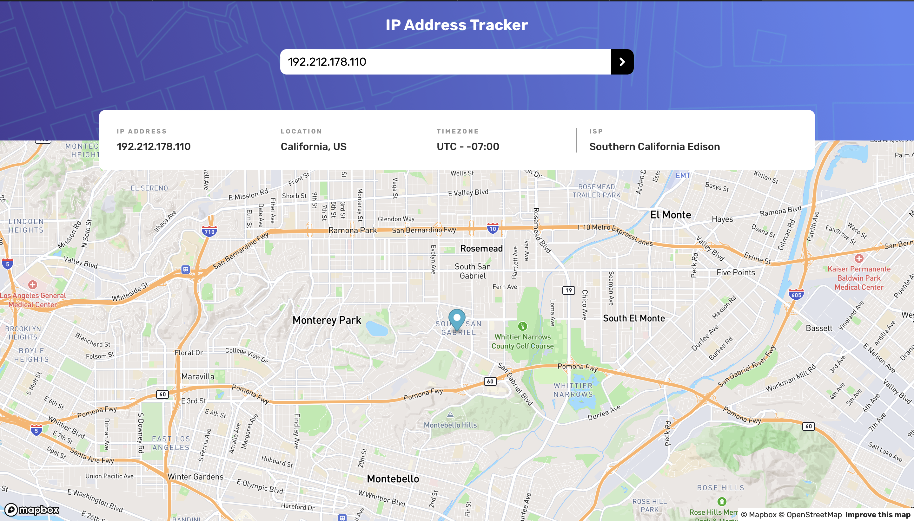
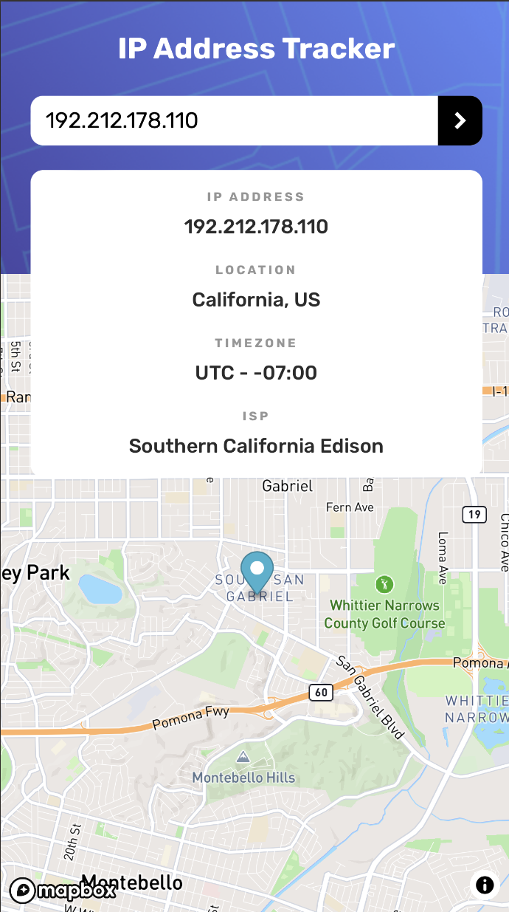

# Frontend Mentor - IP address tracker solution

This is a solution to the [IP address tracker challenge on Frontend Mentor](https://www.frontendmentor.io/challenges/ip-address-tracker-I8-0yYAH0). Frontend Mentor challenges help you improve your coding skills by building realistic projects. 

## Table of contents

- [Overview](#overview)
  - [The challenge](#the-challenge)
  - [Screenshot](#screenshot)
  - [Links](#links)
  - [Built with](#built-with)
- [Author](#author)

## Overview

### The challenge

Users should be able to:

- View the optimal layout for each page depending on their device's screen size
- See hover states for all interactive elements on the page
- See their own IP address on the map on the initial page load
- Search for any IP addresses or domains and see the key information and location

### Screenshot

### Links

- Solution URL: [Solution URL here](https://github.com/irinebthayil/ip-address-tracker)
- Live Site URL: [Live site URL here](http://irinebthayil.github.io/ip-address-tracker)

### Built with

- [React](https://reactjs.org/) - JS library
- Flexbox
- Mobile-first workflow
- [IP Geolocation API by IPify](https://geo.ipify.org/)
- [Mapbox Maps] (https://www.mapbox.com)

## Author

- Github - [Irine B Thayil](https://github.com/irinebthayil)
- Frontend Mentor - [@irinebthayil](https://www.frontendmentor.io/profile/irinebthayil)
- LinkedIn - [Irine B Thayil](https://www.linkedin.com/in/irinebthayil/)